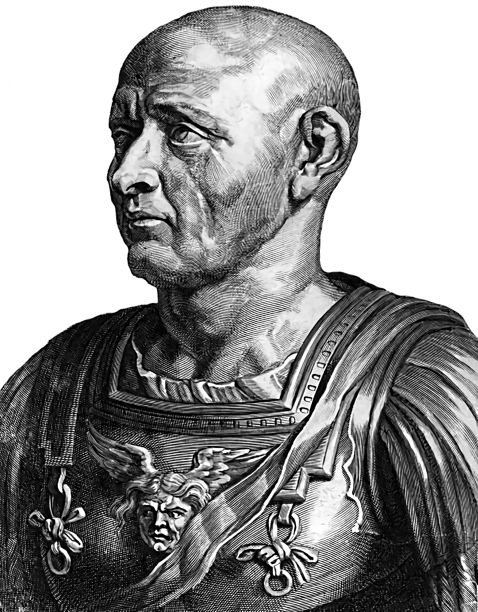

# **scipio-bot**
A BWAPI (BWMirror) Scala based Starcraft Broodwar bot made for an uni assignment for INF01121.\
We'll make 2 versions of the bot: a functional one and a object oriented one.\
The bot is intended to be Terran only, though maybe we'll expand it later.

**Collaborators**:
- Henrique Silva
- Maria Clara Jacintho
- Gabriel Niemiec

---

# **Setup**
Start by installing the latest 32bit [JDK][java] (version 8) and [IntelliJ][intellij] then, in IntelliJ,
- Check off `Scala` on `File -> Setting -> Plugins`
- Set the 32bit JDK as your main JDK
- Import the project 

and then

- Download StarCraft patch 1.16.1 from [here][starcraft]
- Download BWAPI from [here][bwapi]
## *Linux*
1. Install `wine` from your favorite package manager\
I installed mine from pacman using

        sudo pacman -S wine
2. Install `winetricks` also from your favorite package manager
3. Run the BWAPI installer using `wine BWAPI_412_Setup.exe`
4. Install all the packages wine will ask as the installation starts\
There's a chance you'll need to run the .exe again after installing said wine packages
5. Export your Starcraft folder using `export STARCRAFT=~/.wine/drive_c/starcraft` for ease of use 
6. Run Starcraft using

        wine /desktop=Starcraft,800x600 '$STARCRAFT/StarCraft.exe'
7. Ok, so, theoretically, you now should install a `.dll` injector (as ChaosLauncher isn't fond of Linux), but,\
unfortunately, it turns out BWAPI as a whole isn't fond of Linux.\
I tried my best to get it running, but I failed. BUT! a guy at [starcraftai's forum][linux] got it working! You should definitely\
check it out, as I gave up halfway through. I may later try again though.

## *Windows*
1. Paste the extracted StarCraft folder in `C:/Starcraft`
2. Install `BWAPI` inside your StarCraft folder (the installer should create a BWAPI folder inside `C:/Starcraft`)

# **Running the project**
## *Linux*
--WIP--

## *Windows*
1. Run the ChaosLauncher executable that resides inside the BWAPI folder
2. In the launcher, tick both `Injector (RELEASE)` and `W-MODE`
3. Build and run the project on *IntelliJ*
4. Start Starcraft via ChaosLauncher

Now, to test the bot, click:

    Single Player -> Expansion -> Play Custom -> Select map and race -> Play

Note that this process can be automated by copy-pasting `bwapi.ini` into `<starcraft_folder>/bwapi-data/`, inside your\
Starcraft folder.

[java]: http://www.oracle.com/technetwork/java/javase/downloads/jdk8-downloads-2133151.html
[starcraft]: http://files.theabyss.ru/sc/starcraft.zip
[linux]: http://forum.starcraftai.com/viewtopic.php?t=984
[bwapi]: https://github.com/bwapi/bwapi/releases/download/v4.1.2/BWAPI_412_Setup.exe
[intellij]: https://www.jetbrains.com/idea/